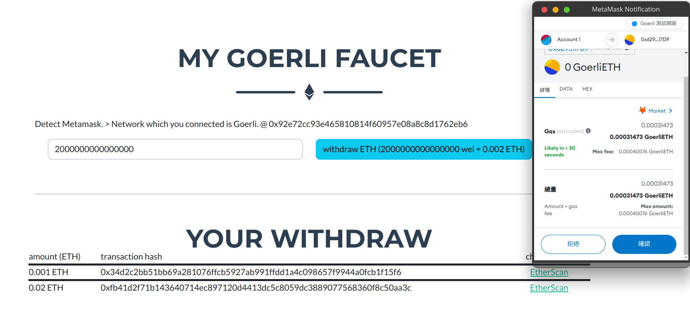

# Faucet Webpage

A simple webpage for Sepolia Testnet's faucet.

It's HW1 for 1112 NCNU CSIE "Principles and Practice of Blockchains"

link to Metamask and create a transaction to the smart contract to get SepoliaETH.




## Project Setup

```sh
npm install
```

### fill in your smart contract's address

```javascript
// /src/views/FaucetView.vue line 46
    const transactionParameters = {
        from: ethereum.selectedAddress,
        to: '',               // smart contract's address
        data: encodeFunctionCall,
        value: '0x00',
    }

```

### Compile and Hot-Reload for Development

```sh
npm run dev
```

### Compile and Minify for Production

```sh
npm run build
```

## Notice

Now, I am not sure of difference between `window.ethereum` & `web3`

I use `window.ethereum` to send transaction, check accounts, check network and use `web3` to encode ABI.

I am not sure whether it's a suitable implementation